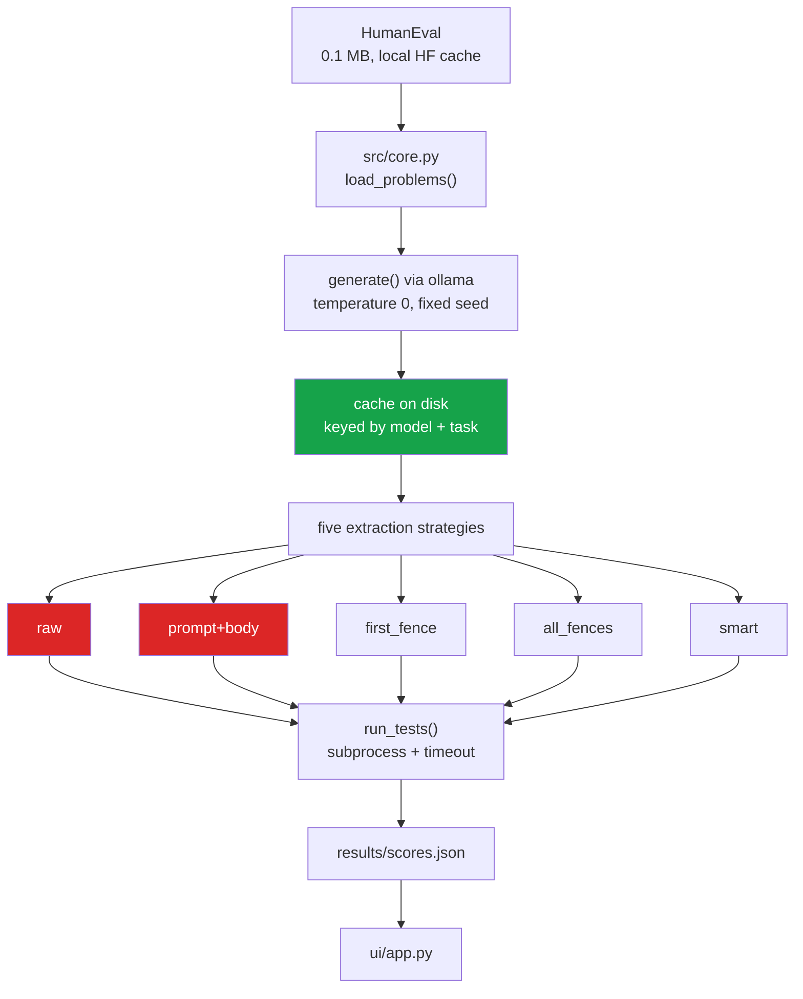

# code-eval-harness

**The same generations score 0% or 94% depending only on how the code is pulled out of
the model's output.**

A code benchmark is reported as one number. But between the model's output and that
number sits an **extraction step** — recovering code from whatever prose and markdown
the model wrapped it in — and that step is a free parameter almost nobody reports.

Here each solution is generated **once**, cached, and then scored under five extraction
strategies. Any spread is the harness's fault, because the model output never changed.

---

## Measured result

HumanEval problems 0–49, greedy decoding (temperature 0, fixed seed), one generation per
(model, problem):

| Model | `raw` | `prompt+body` | `first_fence` | `all_fences` | `smart` |
|---|---|---|---|---|---|
| qwen2.5-coder:3b | **0.0%** | **0.0%** | 94.0% | 94.0% | 94.0% |
| qwen2.5:7b-instruct | **0.0%** | **0.0%** | 94.0% | 94.0% | 94.0% |

**Spread: 94 points, from extraction alone.**

## What is actually going on — two groups, not five results

Being precise about this, because the table overstates the number of independent
findings: **both 0% strategies fail for the identical reason.** 100 out of 100 failures
in each are `SyntaxError`, and the cause is the same — the models wrap their answers in
```` ```python ```` fences, and backticks are not Python.

So this is really **one finding with two faces**:

1. **`raw`** — using the output verbatim fails whenever the model writes markdown.
2. **`prompt+body`** — *this is the original HumanEval protocol*: treat the output as a
   continuation of the function signature. It was designed for **completion** models. A
   chat-tuned model restates the whole function inside a fence, so the concatenation is
   a syntax error.

The second one is the substantive point. **A harness written for completion models
scores modern chat models at zero** — not because they cannot code, but because the
protocol assumes an output shape they no longer produce. That failure is silent: it
looks like a model result, not a harness result.

## The 3B and the 7B are indistinguishable here

Under `smart`, the two models disagree on **2 of 50 problems** (`HumanEval/19`,
`HumanEval/38`). Both score 94.0%.

That is worth knowing before paying for a bigger model on this kind of task: on these
problems, 2.3× the parameters bought nothing measurable.

---

## ⚠️ What these numbers are not

- **Not comparable to published pass@1.** This is the first 50 of 164 problems, which
  are not a random sample — HumanEval is roughly ordered by difficulty, so 94% here
  would be lower on the full set. The purpose is the *spread between strategies*, not
  the absolute score.
- **One sample per problem**, greedy. This is pass@1 at temperature 0, not an estimate
  of pass@k.
- **Two models**, both from the Qwen2.5 family. Not a claim about models in general.

---

## The harness had this exact bug

The runner interpolated `repr(entry_point)`, so HumanEval's `check()` received the
*string* `"add"` instead of the function. Every test failed with
`'str' object is not callable` — **the harness reported 0% for models that were
answering correctly.**

That is precisely the failure this repo exists to measure, and it happened here first.
`test_entry_point_is_passed_as_a_function_not_a_string` now guards it.

---

## Run it

```bash
python src/run_eval.py 50     # generate (cached) and score
streamlit run ui/app.py       # inspect disagreements case by case
pytest -q                     # 19 tests, no network, no model calls
```

Generations are cached on disk keyed by (model, problem), so **adding a sixth extraction
strategy and re-scoring costs no model time at all** — which is the point of separating
generation from scoring.

## ⚠️ Safety

`run_tests` executes code written by a language model. It runs in a separate process, in
a throwaway temp directory, with a timeout — **but it is not a security sandbox.** Do not
point it at untrusted generations on a machine you care about.

---

## How it works



**Generation and scoring are separate on purpose.** Adding a sixth strategy and
re-scoring costs no model time at all.

---

## Problems hit while building this

| Problem | What happened | Fix |
|---|---|---|
| **The harness scored working models at 0%** | The runner interpolated `repr(entry_point)`, so HumanEval's `check()` received the **string** `"add"` instead of the function. Every test failed with `'str' object is not callable` - *precisely the failure this repo exists to measure* | Interpolate the bare name; regression test named after the bug |
| **Two results looked like two findings** | `raw` and `prompt+body` both scored 0%, implying independent failure modes | Checked the reasons: **100 of 100 `SyntaxError` for each, same cause**. The README says so rather than implying five independent results |
| **Unicode crash on Windows** | Printing a non-ASCII character to a `cp1252` console killed an inspection script | Set `PYTHONIOENCODING=utf-8` and kept non-ASCII out of program output |
| **`plotly` unavailable** | The charts were written for plotly, which was not installed, and the connection was too slow to fetch it | Rewrote them in **Altair**, which ships with Streamlit - zero download |
| **Buffered logs hid progress** | Redirected stdout showed nothing for minutes at a time | Tracked progress by counting cached generation files instead |

---

## Future work

1. **Run the full 164 problems.** The current 50 are the easier half, so the absolute
   numbers are not comparable to published pass@1 - the README says so explicitly.
2. **Add `qwen2.5-coder:14b`.** The comparison code is written and generations are
   cached, so it is one command once the model finishes downloading.
3. **pass@k with sampling** at temperature above 0, which is what published numbers
   usually report.
4. **Add MBPP** (already downloaded) to check whether the spread is HumanEval-specific.
5. **A real sandbox.** Execution is a subprocess with a timeout - a guard, not a security
   boundary. Containerisation or `seccomp` would make it safe for untrusted generations.
6. **Treat the prompt as a variable too.** Prompt phrasing is a second unreported free
   parameter, and the same generate-once/score-many design would measure it.
7. **Publish a recommended extraction standard** so reported pass@1 numbers become
   comparable between papers.

---

## Stack

`Python 3.11+` · `Ollama` (local inference) · `pandas` · `pyarrow` · `Streamlit` ·
`Altair` · `pytest` · `ruff` · `GitHub Actions` · HumanEval via `Hugging Face Hub`

## Keywords

HumanEval · pass@k · pass@1 · code generation benchmark · LLM evaluation · evaluation
harness · answer extraction · benchmark reproducibility · local LLM · Ollama · Qwen2.5 ·
code LLM · prompt sensitivity · harness bias · LLM benchmarking methodology ·
deterministic evaluation

## Layout

```
src/core.py       data loading, generation+cache, the five strategies, execution
src/run_eval.py   generate once, score every way, write results/scores.json
ui/app.py         Streamlit: the matrix, and every case where strategies disagree
tests/            19 tests using hand-written "model output" - no ollama needed
```

## Data

`openai/openai_humaneval` (164 problems, 0.1 MB) from the local Hugging Face cache.
Models served locally by ollama.
